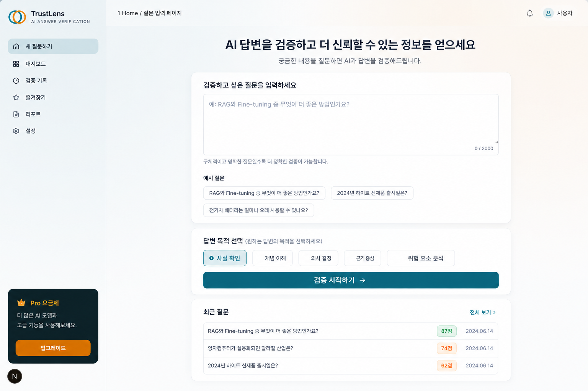
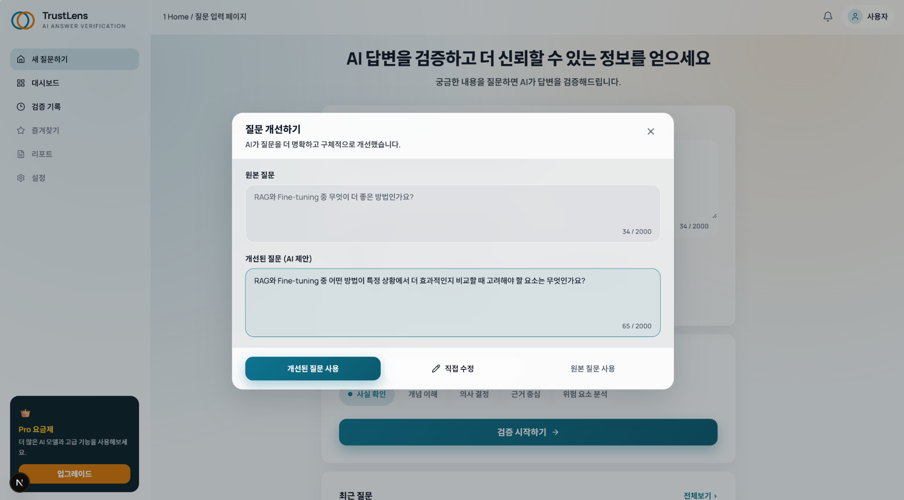
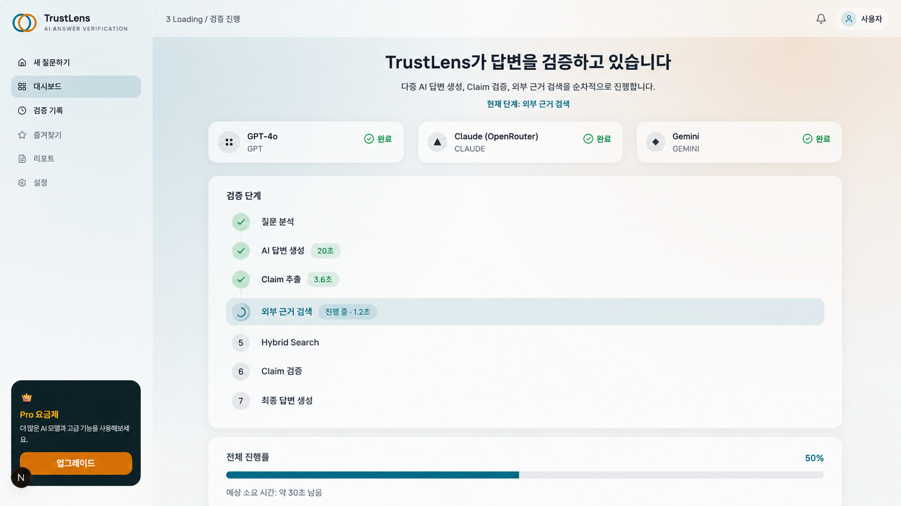
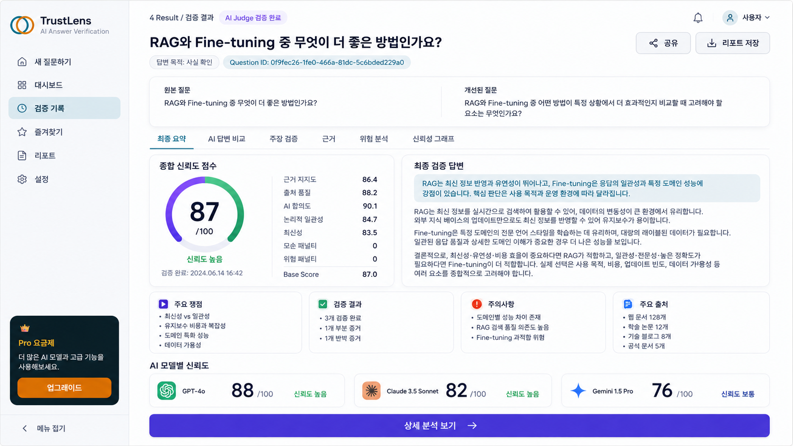
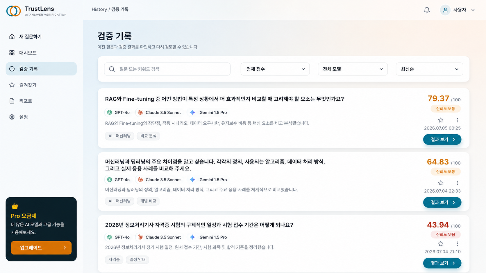

# TrustLens

> 여러 AI의 답변을 비교하고 외부 근거로 검증하여,  
> **신뢰도 점수와 최종 검증 답변을 제공하는 AI 답변 신뢰성 검증 플랫폼**

---

## 프로젝트 소개

생성형 AI는 빠르고 편리하지만, 사실과 다른 내용을 자신 있게 답하는 **환각(Hallucination)** 문제가 존재합니다.

사용자는 중요한 정보를 확인하기 위해 다음과 같은 과정을 반복하기도 합니다.

```text
ChatGPT에 질문
→ Gemini에 다시 질문
→ Claude와 비교
→ 검색을 통해 사실 확인
```

TrustLens는 이 과정을 하나의 서비스 안에서 자동으로 수행합니다.

```text
사용자 질문
→ GPT, Claude, Gemini가 각각 답변
→ 답변 속 주요 주장 추출
→ 검색과 계산을 통해 사실 확인
→ AI 답변 간 일치·충돌 분석
→ 신뢰도 점수 계산
→ 검증된 최종 답변 제공
```

---

## 핵심 기능

### 다중 AI 답변 비교

GPT, Claude, Gemini가 서로의 답변을 보지 않고 독립적으로 답변합니다.

한 AI의 답변만 사용하는 것이 아니라 여러 AI의 공통점과 차이점을 비교합니다.

---

### Claim 단위 검증

긴 답변 전체를 한 번에 평가하지 않고, 검증 가능한 작은 주장인 `Claim`으로 나눕니다.

예시:

```text
AI 답변:
RAG는 외부 문서를 검색하기 때문에 최신 정보를 반영하기 쉽다.

Claim:
C1. RAG는 외부 문서를 검색한다.
C2. RAG는 최신 정보를 반영하기 쉽다.
```

각 Claim마다 실제 근거를 찾아 개별적으로 검증합니다.

---

### 외부 근거 검색

Tavily Search를 이용해 다음과 같은 자료를 검색합니다.

- 공식 문서
- 정부 자료
- 논문 및 학술 자료
- 기술 문서
- 뉴스
- 웹페이지

검색 결과의 개수보다 **출처의 신뢰도와 Claim을 직접 뒷받침하는지**를 중요하게 평가합니다.

---

### 계산·공식 직접 검증

검색이 필요하지 않은 문제는 시스템이 직접 계산합니다.

지원 대상 예시:

- 사칙연산
- 진법 변환
- 논리 연산
- 단위 변환
- 공식 적용

예를 들어 AI가 `1010₂ = 10`이라고 답한 경우, 시스템이 진법 변환을 직접 수행한 뒤 결과를 비교합니다.

---

### 설명 가능한 Trust Score

최종 점수만 보여주는 것이 아니라 다음 정보도 함께 제공합니다.

- 어떤 근거가 사용되었는지
- 어떤 Claim이 검증되었는지
- 어떤 내용의 근거가 부족한지
- AI 답변 간 실제 모순이 있는지
- 점수가 높거나 낮은 이유
- 주의가 필요한 내용

---

## 전체 동작 흐름

```text
1. 사용자가 질문 입력

2. AI가 질문을 더 명확하게 개선

3. GPT, Claude, Gemini가 독립적으로 답변

4. 각 답변에서 검증 가능한 Claim 추출

5. 비슷한 Claim을 하나로 통합

6. 계산 가능한 내용은 직접 검증

7. 검색이 필요한 내용은 외부 자료 검색

8. Claim과 가장 관련 있는 근거 선택

9. 근거가 Claim을 지지하는지 판정

10. AI 답변 간 합의와 모순 분석

11. 위험 요소 분석

12. Trust Score 계산

13. 검증된 내용으로 최종 답변 생성
```

---

## 검색 및 근거 선택 과정

TrustLens는 단순히 웹 검색 결과를 가져오는 데서 끝나지 않습니다.

검색한 문서 중에서 각 Claim과 가장 관련 있는 부분을 다시 찾아 검증에 사용합니다.

### 1. AI 답변에서 Claim 추출

AI의 긴 답변을 검증 가능한 짧은 주장으로 나눕니다.

```text
C1. RAG는 외부 정보를 검색한다.
C2. RAG는 최신 정보 반영에 유리하다.
```

### 2. Claim별 검색어 생성

각 Claim을 확인하기 위한 검색어를 생성합니다.

```text
RAG external information retrieval official documentation
RAG latest information advantages
```

### 3. Tavily로 인터넷 검색

생성한 검색어를 이용해 관련 웹 문서를 찾습니다.

### 4. 검색 문서를 DB에 저장

검색된 문서의 다음 정보를 저장합니다.

```text
제목
URL
출처
본문
게시 날짜
검색어
```

### 5. 문서를 작은 Chunk로 분리

긴 문서를 짧은 문단 단위로 나눕니다.

```text
문서 전체
├── Chunk 1: RAG 정의
├── Chunk 2: 외부 검색 방식
├── Chunk 3: 최신 정보 활용
└── Chunk 4: 한계점
```

### 6. Chunk를 Embedding으로 변환

각 문단의 의미를 숫자 Vector로 변환합니다.

이 Vector는 PostgreSQL의 `pgvector`에 저장됩니다.

### 7. Keyword Search 실행

Claim과 문서에 같은 단어나 핵심 용어가 포함되어 있는지 확인합니다.

```text
RAG
외부 검색
최신 정보
```

### 8. Vector Search 실행

사용된 단어가 달라도 문장의 의미가 비슷한지 확인합니다.

```text
Claim:
최신 정보를 반영한다.

문서:
새로운 외부 자료를 답변에 활용할 수 있다.
```

두 문장은 표현이 다르지만 의미가 비슷하므로 관련 문서로 찾을 수 있습니다.

### 9. Hybrid Score 계산

Keyword Search와 Vector Search 결과를 결합합니다.

```text
Hybrid Score =
0.6 × Keyword Score
+ 0.4 × Vector Score
```

- Keyword Search: 정확한 용어 검색에 강함
- Vector Search: 표현이 다른 비슷한 의미 검색에 강함

### 10. 관련도가 높은 근거 3~5개 선택

각 Claim과 가장 관련성이 높은 문서 조각을 Evidence로 선택합니다.

### 11. 근거가 Claim을 지지하는지 검증

선택된 근거와 Claim을 비교하여 다음 상태로 분류합니다.

| 상태 | 의미 |
|---|---|
| `Verified` | 근거가 Claim을 직접 뒷받침함 |
| `Weak Evidence` | 관련 근거는 있지만 직접적인 확인이 부족함 |
| `Unsupported` | 확인할 수 있는 근거를 찾지 못함 |
| `Contradicted` | 근거가 Claim과 반대됨 |

---

## AI 답변 비교 방식

TrustLens는 단순한 문장 일치 여부가 아니라 **핵심 의미가 같은지**를 비교합니다.

예를 들어 다음 세 답변은 표현은 다르지만 같은 의미로 판단합니다.

```text
GPT:
RAG는 최신 정보를 반영하기 쉽다.

Claude:
외부 문서를 검색하기 때문에 새로운 자료를 활용할 수 있다.

Gemini:
필요한 정보를 검색해서 답변에 반영할 수 있다.
```

반면 다음과 같이 핵심 내용이 반대인 경우 실제 모순으로 판단합니다.

```text
GPT:
RAG는 모델을 다시 학습하지 않아도 된다.

Gemini:
RAG를 사용하려면 반드시 모델을 다시 학습해야 한다.
```

한 모델이 추가 설명을 했거나 다른 모델이 일부 내용을 언급하지 않은 것은 모순으로 처리하지 않습니다.

---

## Trust Score 계산

최종 점수는 AI가 임의로 결정하지 않습니다.

Backend에서 정해진 기준에 따라 계산합니다.

```text
Base Score =
0.40 × Evidence Support
+ 0.20 × Source Quality
+ 0.15 × Consensus
+ 0.15 × Logic
+ 0.10 × Freshness
```

```text
Final Score =
Base Score
- Contradiction Penalty
- Risk Penalty
```

### 평가 항목

| 항목 | 비중 | 평가 내용 |
|---|---:|---|
| 근거 지지도 | 40% | 실제 근거가 Claim을 얼마나 직접적으로 뒷받침하는지 |
| 출처 품질 | 20% | 공식 문서, 논문, 뉴스 등 출처의 신뢰도 |
| AI 합의도 | 15% | 여러 AI의 핵심 답변이 얼마나 일치하는지 |
| 논리적 일관성 | 15% | 답변 내부에 실제 모순이나 잘못된 추론이 있는지 |
| 최신성 | 10% | 정보가 현재도 유효한지 |

### 점수 계산 원칙

- 추가 설명의 차이는 논리적 불일치가 아닙니다.
- 한 AI의 단순 미언급은 반대 의견이 아닙니다.
- 검색 결과의 개수가 많다고 점수가 높아지지 않습니다.
- 공식 출처 하나가 Claim을 직접 확인하면 높은 점수를 받을 수 있습니다.
- 계산 문제는 독립 검증에 성공하면 높은 신뢰도를 받을 수 있습니다.
- 같은 모순이나 위험 요소를 여러 항목에서 중복 감점하지 않습니다.

---

## 결과 화면

TrustLens는 최종 답변과 함께 검증 과정을 확인할 수 있는 상세 결과를 제공합니다.

### 종합 요약

- 최종 Trust Score
- 검증된 최종 답변
- 점수 산정 이유
- 주요 주의사항
- 사용된 출처

### AI 답변 비교

- GPT 원본 답변
- Claude 원본 답변
- Gemini 원본 답변
- 공통적으로 일치한 내용
- 실제로 충돌한 내용
- 모델별 추가 설명

### Claim 검증

- Claim ID
- Claim 내용
- AI 합의도
- 검증 상태
- 연결된 Evidence
- 위험 요소

### Evidence

- 출처 제목
- 출처 유형
- 근거 문장
- 검색 날짜
- 관련도
- 원문 링크

### 위험 분석

- 환각 가능성
- 낮은 출처 신뢰도
- 오래된 정보
- AI 답변 간 모순

### 검증 기록

이전에 분석한 질문과 결과를 다시 조회하고 재분석할 수 있습니다.

---

## 주요 화면

### 질문 입력



### 질문 개선



### 분석 진행



### 결과 요약



### 검증 기록



---

## 시스템 구성

```text
사용자
↓
Frontend
↓
Backend Server
├── GPT
├── Claude
├── Gemini
├── Tavily Search
└── Embedding
↓
PostgreSQL + pgvector
↓
검증 결과 및 최종 답변
```

---

## 기술 스택

### Frontend

- Next.js
- React
- TypeScript
- Tailwind CSS

### Backend

- FastAPI
- Python
- SQLAlchemy
- Pydantic
- Alembic

### Database

- PostgreSQL
- pgvector
- PostgreSQL Full Text Search

### External Services

- OpenAI
- Claude
- Gemini
- Tavily
- OpenAI Embedding

---

## 프로젝트 구조

```text
TrustLens/
├── frontend/          # 사용자 화면
├── backend/           # API 및 검증 파이프라인
├── assets/UI/         # UI 설계 이미지
├── docs/              # 기획 및 기술 문서
├── README.md
└── CLAUDE.md
```

상세한 API, DB, 점수 계산 및 프롬프트 구조는 `docs` 폴더에서 확인할 수 있습니다.

---

## 프로젝트의 차별점

기존 AI 서비스는 일반적으로 한 모델이 검색하고 답변을 생성합니다.

TrustLens는 다음과 같은 차이가 있습니다.

| 일반 AI 서비스 | TrustLens |
|---|---|
| 하나의 AI 답변 중심 | GPT, Claude, Gemini 답변 비교 |
| 검색 결과를 참고해 답변 생성 | Claim마다 근거를 연결해 검증 |
| 답변 전체를 한 번에 제공 | Claim별 검증 상태 제공 |
| 신뢰 여부를 사용자가 직접 판단 | Trust Score와 산정 이유 제공 |
| AI 합의만으로 판단할 가능성 | 검색·계산·출처 품질을 함께 반영 |
| 최종 답변만 제공 | 원본 답변, 근거, 위험 요소까지 제공 |

---

## 활용 대상

- AI 답변을 과제와 학습에 활용하는 학생
- 여러 자료를 비교해야 하는 직장인
- 기술 정보를 조사하는 개발자
- 최신 정보의 근거를 확인하고 싶은 사용자
- 중요한 판단 전에 AI 답변을 검증하고 싶은 사용자

---

## 한계 및 향후 개선

Trust Score는 절대적인 정답 판정이 아니라 사용자의 판단을 돕는 보조 지표입니다.

현재 시스템의 주요 한계는 다음과 같습니다.

- 검색 결과 자체가 부정확할 수 있음
- 공식 자료가 검색되지 않을 수 있음
- 여러 AI가 동시에 같은 오류를 낼 수 있음
- 외부 API 사용으로 처리 시간과 비용이 증가함
- 의료·법률과 같은 전문 분야에는 추가 검증이 필요함

향후에는 다음 기능을 확장할 수 있습니다.

- 분야별 전문 출처 우선 검색
- 전문가 검증 데이터셋 기반 평가
- 문서·PDF 업로드 검증
- 팀 단위 검증 결과 공유
- 비용과 처리 시간을 고려한 자동 검증 단계 선택
- Trust Score와 실제 정답률의 상관관계 평가

---

## 프로젝트 요약

```text
여러 AI에게 질문하고,
각 답변의 주장을 검색과 계산으로 확인한 뒤,
믿을 수 있는 내용만 정리하여
신뢰도 점수와 함께 제공하는 플랫폼
```